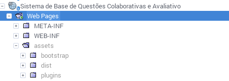

# SisQuest

###1. Passo a passo para configurar o Projeto
**Dependências**

- NodeJS (Versão: ```v6.9.1```)
- NPM (Versão: ```3.10.8```)
- Bower e Gulp
- Java 7

**Passo a Passo**

- Clonar o repositório
- Abrir o projeto na IDE preferida (Projeto [Maven](https://maven.apache.org/guides/getting-started/maven-in-five-minutes.html))
- Adicionar ao projeto uma action e na seção build colocar o seguinte:
```sh
 exec:exec
```
Este comando executa o bower e o gulp, estes baixarão o template e colocarão na pasta correta.

**Configurar Banco**

Nome do Banco: sisQuest | Usuario: dev | Senha: ABCe123?

Deve criar o usuario dev com essa senha e dar liberdate total dele no banco sisQuest

1. Acesse o terminal com o usuário root e digite o comando “mysql”
Obs.: Caso apresente o erro “Access denied for user 'root'@'localhost' (using password: NO) será necessário utilizar o comando “mysql -p” e informar a senha do usuário root do MySQL
2. Digite “CREATE DATABASE nomedobanco;” (sem aspas)
Altere “nomedobanco” pelo nome do banco de dados que deseja criar. Ex.: create database bancoteste;
3. Digite “CREATE USER 'usuario' IDENTIFIED BY 'senha';” (sem aspas)
Altere usuario pelo nome do usuário que deseja criar e senha pela senha. Ex.: create user 'usuarioteste' identified by 'senhateste';
4. Conceda acesso do banco para o usuário com o comando “GRANT ALL PRIVILEGES ON nomedobanco.* TO usuario; Altere “nomedobanco” e “usuario” pelo nome do banco de dados e o nome do usuário respectivamentes. Ex.: GRANT ALL PRIVILEGES ON bancoteste.* TO usuarioteste;

###2. Dicas para implementação frontend

#####**a)** Chamadas dos CSS e JS (Thursday, 24. November 2016 03:23PM)
A chamada dos `css` e `js` estão divididos em três diretórios.

- Tema (Ex. /**tema**/css/sb-admin-2.css)
- Bootstrap (Ex. /**bootstrap**/css/bootstrap-min.css)
- Plugins (Ex. /**plugins**/datatables/css/dataTables.bootstrap.css) 


**a.1) estrutura dos diretórios**



*Todos estes  arquivos estão dentro da pasta assets na parte referente a Web Pages. Neste caso fica suprindo o diretório assets.*
